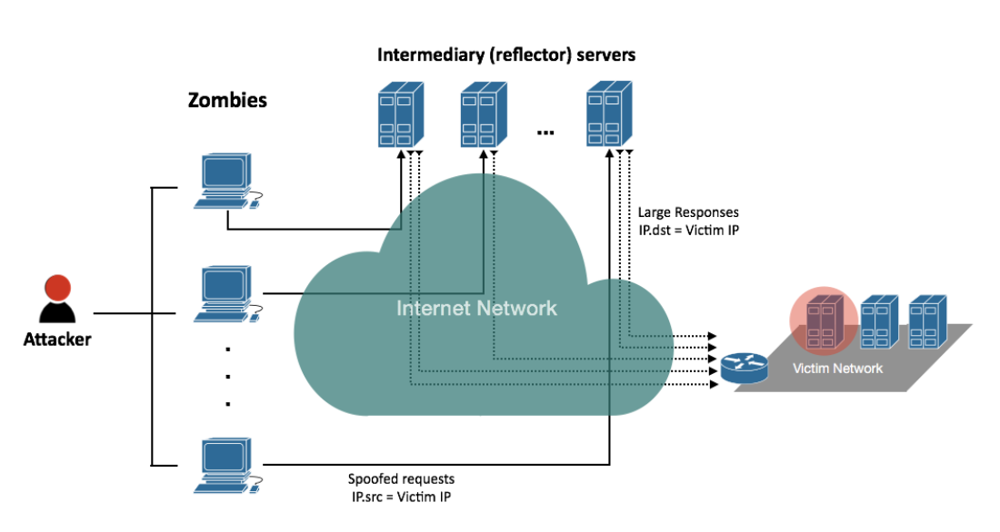
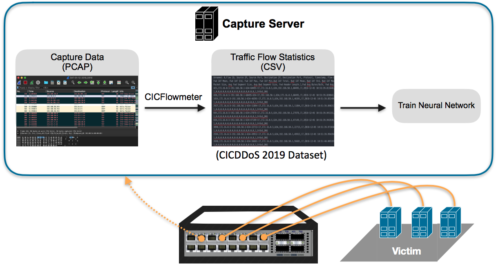

# **ADIDoS: Automatic Detection and Identification of DDoS Attacks** #

> This repository provides the necessary codes to reproduce the work done in the CMPT980 project Spring 2020 (Instructed by [Khaled Diab](http://www.sfu.ca/~kdiab/)).

Contributors: Omar Mossad (omossad@sfu.ca), Parham Yassini (pyassini@sfu.ca) 

Project summary and demo video: https://youtu.be/8QBZlXfdA4w

<!-- TABLE OF CONTENTS -->
<details open="open">
  <summary>Contents</summary>
  <ol>
    <li>
      <a href="#about-the-project">About The Project</a>
    </li>
    <li>
      <a href="#getting-started">Getting Started</a>
    </li>
  </ol>
</details>

# About the Project

The Distributed Denial of Service (DDoS) attacks, overwhelm servers and network resources with malicious traffic and render them unusable. Despite extensive research efforts, the last two years have witnessed an increase in the severity of these attacks. Recently, a large number of datasets were created to mimic the DDoS packets and their network characteristics in order to help researchers identify these attacks. Various statistical and analytical models were developed to form a line of defence that can be implemented in Intrusion Detection Systems (IDS). In this paper, we propose a Machine Learning (ML) model that can identify DDoS packets among ordinary network traffic. Our evaluations on the CIC-DDoS-2019 dataset demonstrate that our ML model outperforms the recently proposed classifiers built on Decision Trees, Na ̈ıve Bayesian and polynomial regression. The f1-score for our model is 75% compared to 69% for the state-of-the-art decision tree classifier. Moreover, we extend the model task to classify the DDoS attacks and achieve an accuracy of 62%.

### Attack Model


### System 


### Neural Network Architecture
The binary classification model incorporates 3 hidden layers each of size 64. For each packet, the 28 features previously described are fed to the input layer after pre-processing. We used a quantile transformer to normalize the features values. All the network layers use ReLU activation functions, whereas the output layer has a Softmax classifier. Figure 4 depicts the overall network architecture. For the hyper-parameters, we used 10 epochs and a categorical cross-entropy optimizer.

The categorical classifier differs mainly in the output layer. The Softmax in this case has 13 outputs representing the different DDoS attack types.


# Getting Started
Instructions for reproducing the results and using the developed model and analysis scripts:
## Folders and Files
1- **requirements.txt**: packages and dependencies.\
2- **code**: folder containing the final codes.\
3- **reference**: folder containing the replication of the reference code.\
4- **cedar**: job scripts and outputs for running on Compute Canada.

## Dependencies

The code has been tested using python **3.7.4**\
The **requirements.txt** provides the required packages.

## Folder Structure 
Our codes are provided in the **code** folder.\
There are 2 executable codes for the models:\
1- **ML_binary_classifier.py**: for detecting malicious Vs benign traffic.\
2- **ML_category_classifier.py**: for classifying the type of DDoS attack.\
There is a **features.txt** file that determines which features will be used in the training.

There are 2 codes for the dataset and feature exploration:\
1- **feature_exploration.py**: Code for recursive feature elimination. Outputs the plot of the corss validation scores vs. number of selected features to identify number of important features. Also, based on the previous step, it outputs 28 most important features to be used as input of the classifier codes.\
2- **dataset_exploration.py**: Is a basic code for reading all of the data and outputs a plot of the label distribution (types of attacks) in the dataset. Also, outputs mean of the "Flow duration (us)" in attack and bengin types. These duration means are used to compare the detection latency vs. attack flow duration.

## Reference ###
The reference paper we used in the evaluations can be reproduced using the code in the **reference** folder.\
This code was cloned and modified from the following repository:\
https://github.com/tompkj/647_ML_Final 

## Running on Compute Canada###
We ran our codes using Compute Canada Cedar, therefore we provided the scripts to submit jobs to the large GPU nodes in the **cedar** folder.\
Additionally, we provide 2 pre-trained models to test the code inside the **cedar/output** folder.

## Run Instructions 
### Dataset
The code depends on the CIC-DDoS 2019 dataset.\
You will need to download and extract the .CSV files from the dataset using this link: https://www.unb.ca/cic/datasets/ddos-2019.html \
The following instructions apply to both binary and category classifiers.\
\
Create a new virtual environment
``` 
python3 -m venv /path/to/new/virtual/environment
```
Activate the environment
```
cd /path/to/new/virtual/environment
/bin/activate
```
Move to the project folder and install the dependencies
```
cd /path/to/project
pip3 install -r requirements.txt
```
Create a folder to hold the outputs
```
mkdir cedar/output/new_folder
```
Navigate to the code Folders
```
cd code
```
Modify the following directories in the **ML_binary_classifier.py** or **ML_category_classifier.py** to point to the actual directories.
```Python
train_dir  = '/CICDDoS2019/CSVs/01-12/'
test_dir   = '/CICDDoS2019/CSVs/03-11/'
output_dir ='../cedar/output/new_output_folder'
```
[*Optional*]\
For quick testing of the code, restrict the number of rows read from the files to a small number using:
```Python
df = pd.read_csv(filename, nrows=100)
```
You can modify the **features.txt** to include more features or alternatively use the default settings.\

In order to train the network use the following command
```
python3 ML_binary_classifier.py train features.txt new_output_folder
or
python3 ML_category_classifier.py train features.txt new_output_folder

```

For just testing the pre-trained network, use the following command
```
python3 ML_binary_classifier.py test features.txt new_output_folder ../cedar/output/ML_binary_classifier_model
or
python3 ML_category_classifier.py test features.txt new_output_folder ../cedar/output/ML_category_classifier_model
```
You can replace the model with your saved model or use the already saved ones.

## Running the feature and dataset exploration codes
For running the feature_exploration.py use: 
```
python feature_exploration.py <path to directory of training CSVs> <path to directory of test CSVs>
```
For running the dataset_exploration.py use: 
```
python dataset_exploration.py <path of features.txt> 
```
The output plots of these two codes are saved to "SVG" files. 
## Running the reference code ###
To run the reference code, most instructions are similar.\
We only managed to run this code using a maximum of 1M rows only from each file, otherwise we get *out of memory errors*.
```
cd ../reference
python3 reference.py features.txt
```

In order to execute the code on Compute Canada, you need to acquire access to the cluster and modify the email and paths in the bash script to point to your local directories.
```
cd ../cedar/scripts
sbatch filename.sh
```
